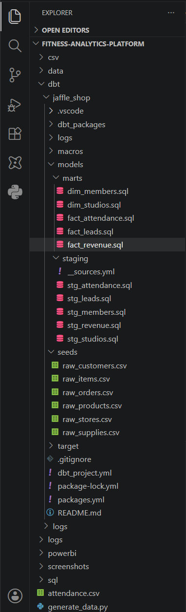

# Fitness Franchise Analytics Platform

## Project Overview

This project demonstrates the design and implementation of a modern analytics platform for a multi-location fitness franchise.

Using Python, Snowflake, dbt, SQL, and Power BI, I built an end-to-end analytics solution capable of tracking membership growth, revenue performance, marketing effectiveness, and customer churn.

The platform simulates a nationwide fitness business with 100 studios and over 770,000 records across membership, attendance, lead generation, and revenue datasets.

---

## Business Problem

Fitness franchises generate large volumes of operational and marketing data but often struggle to convert that information into actionable business decisions.

The goal of this project was to create a centralized analytics platform capable of answering key business questions:

* Which studios generate the most revenue?
* Which marketing channels drive the highest lead volume?
* How effectively are leads converted into members?
* What is the current member churn rate?
* Which membership tiers contribute most to the business?

---

## Technology Stack

* Python
* Snowflake
* SQL
* dbt
* Power BI
* GitHub

---

## Data Volume

| Dataset              | Records |
| -------------------- | ------: |
| Members              |  50,000 |
| Studios              |     100 |
| Marketing Leads      |  20,000 |
| Attendance Records   | 500,000 |
| Revenue Transactions | 200,000 |

---

## Architecture

Python → Snowflake → dbt → Power BI

### Data Flow

1. Python generated realistic synthetic business data.
2. CSV files were loaded into Snowflake RAW tables.
3. dbt transformed raw data into staging models.
4. Fact and dimension tables were created using a star schema design.
5. Power BI delivered executive-level reporting and KPI tracking.

---

## Executive Dashboard

---

## Data Model

---

## Snowflake Data Warehouse

---

## dbt Project

---

# Key Metrics

* Revenue: $15.16M
* Members: 50,000
* Marketing Leads: 20,000
* Lead Conversion Rate: 34.9%
* Churn Rate: 27.7%
* Revenue per Member: $303

---

# Business Insights

### Member Retention Opportunity

The current churn rate of 27.7% indicates a significant opportunity to improve member retention. Even modest reductions in churn could substantially increase recurring revenue.

### Marketing Optimization

Lead conversion currently averages 34.9%. Analyzing lead source performance can help prioritize acquisition channels that generate the highest return on investment.

### Studio Performance Benchmarking

Top-performing studios generate significantly higher revenue than average locations. Their operational practices can be studied and replicated across lower-performing studios.

### Membership Upsell Strategy

Basic memberships represent the largest share of the member base. Targeted upgrade campaigns could increase adoption of Premium and Elite memberships and improve revenue per member.

---

# Skills Demonstrated

* Data Warehousing
* Analytics Engineering
* Dimensional Modeling
* SQL Development
* dbt Transformations
* Power BI Dashboard Design
* Business Analytics
* KPI Development
* Data Storytelling

---
