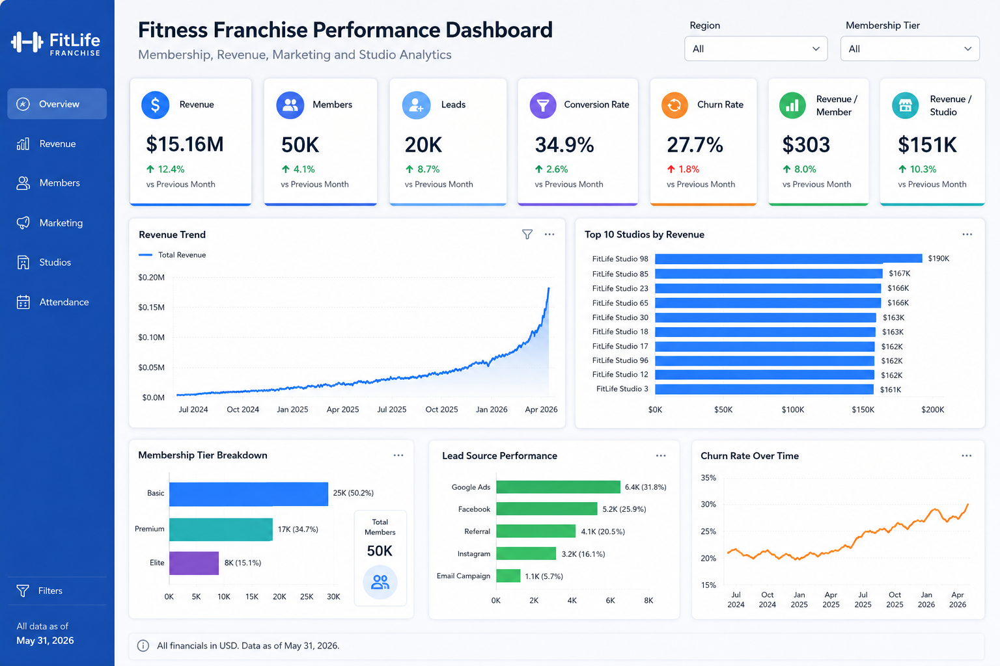
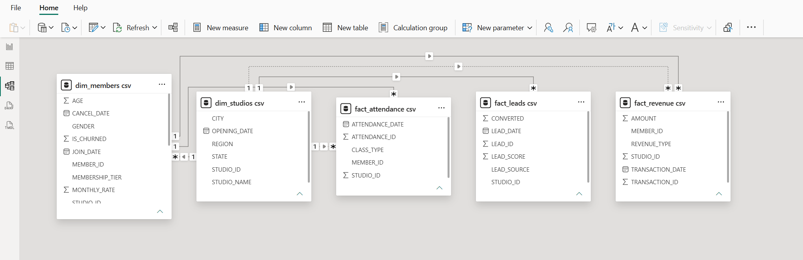
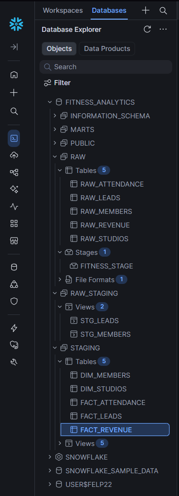

# Fitness Franchise Analytics Platform

## Overview

This project demonstrates the design and implementation of a modern analytics platform for a multi-location fitness franchise.

Using Python, Snowflake, dbt, SQL, and Power BI, I built an end-to-end analytics solution capable of tracking membership growth, revenue performance, marketing effectiveness, and customer churn.

The platform simulates a nationwide fitness business with 100 studios and over 770,000 records across membership, attendance, lead generation, and revenue datasets.

---

## Business Problem

Fitness franchises generate large volumes of operational and marketing data but often struggle to convert that information into actionable business decisions.

The goal of this project was to create a centralized analytics platform capable of answering key business questions:

- Which studios generate the most revenue?
- Which marketing channels drive the highest lead volume?
- How effectively are leads converted into members?
- What is the current member churn rate?
- Which membership tiers contribute most to the business?
- Where are the greatest opportunities for revenue growth?

---

## Technology Stack

- Python
- Snowflake
- SQL
- dbt
- Power BI
- GitHub

---

## Data Volume

| Dataset | Records |
|----------|----------:|
| Members | 50,000 |
| Studios | 100 |
| Marketing Leads | 20,000 |
| Attendance Records | 500,000 |
| Revenue Transactions | 200,000 |

---

## Architecture

```text
Python
   ↓
Snowflake RAW Layer
   ↓
dbt Staging Models
   ↓
Fact & Dimension Tables
   ↓
Power BI Executive Dashboard
```

### Data Flow

1. Generated realistic synthetic fitness franchise data using Python.
2. Loaded CSV files into Snowflake RAW tables.
3. Built dbt staging models to standardize and transform source data.
4. Designed dimensional models using fact and dimension tables.
5. Developed an executive Power BI dashboard for business stakeholders.

---

# Executive Dashboard



---

# Power BI Data Model



The semantic model follows a star schema design:

### Dimension Tables

- Dim Members
- Dim Studios

### Fact Tables

- Fact Revenue
- Fact Attendance
- Fact Leads

This structure improves reporting performance, simplifies business logic, and follows dimensional modeling best practices.

---

# Snowflake Data Warehouse



The Snowflake environment was structured using a layered architecture:

### RAW Layer

Stores source data loaded from generated CSV files.

### STAGING Layer

Applies standardization and transformation logic through dbt models.

### MART Layer

Provides business-ready fact and dimension tables for reporting and analytics.

---

# dbt Project Structure


dbt was used to transform raw Snowflake data into analytics-ready models.

### Staging Models

- stg_members
- stg_studios
- stg_leads
- stg_attendance
- stg_revenue

### Mart Models

- dim_members
- dim_studios
- fact_leads
- fact_attendance
- fact_revenue

---

# Key Metrics

| KPI | Value |
|------|------:|
| Revenue | $15.16M |
| Members | 50,000 |
| Marketing Leads | 20,000 |
| Conversion Rate | 34.9% |
| Churn Rate | 27.7% |
| Revenue per Member | $303 |

---

# Executive Recommendations

## Reduce Member Churn

Current churn is 27.7%, representing a significant opportunity to increase recurring revenue.

A reduction of just 5 percentage points could retain approximately 2,500 additional members and improve long-term customer lifetime value.

---

## Improve Marketing ROI

Lead conversion currently averages 34.9%.

Marketing investment should focus on the highest-performing acquisition channels while reducing spend on lower-performing lead sources.

---

## Increase Revenue Per Member

Basic memberships account for over 50% of the member base.

Targeted upsell campaigns promoting Premium and Elite memberships could increase revenue per member and overall profitability.

---

## Replicate Top Studio Practices

Top-performing studios generate significantly higher revenue than average locations.

Operational and marketing strategies from these studios should be analyzed and standardized across lower-performing locations.

---

# Skills Demonstrated

### Data Engineering

- Python Data Generation
- Snowflake Data Loading
- SQL Development

### Analytics Engineering

- dbt Transformations
- Data Modeling
- Star Schema Design
- Fact & Dimension Modeling

### Business Intelligence

- Power BI Dashboard Development
- KPI Design
- Executive Reporting
- Data Storytelling

### Business Analytics

- Revenue Analysis
- Churn Analysis
- Lead Conversion Analysis
- Performance Benchmarking
- Strategic Recommendations

---

# Repository Structure

```text
fitness-franchise-analytics/
│
├── Screenshots/
│   ├── dashboard.png
│   ├── dashboard_concept.png
│   ├── data_model.png
│   ├── snowflake_architecture.png
│   └── dbt_project.png
│
├── python/
│   └── generate_fitness_data.py
│
├── sql/
│   └── fitness_analytics_setup.sql
│
├── dbt/
│   ├── staging/
│   └── marts/
│
└── README.md
```

---

# Future Enhancements

- Predictive churn modeling
- Member lifetime value analysis
- Marketing attribution reporting
- Forecasting revenue and membership growth
- Interactive drill-through reporting
- Automated dbt testing and documentation

---

## Author

Felipe Ismerio

End-to-end analytics platform built using Python, Snowflake, dbt, SQL, and Power BI.
